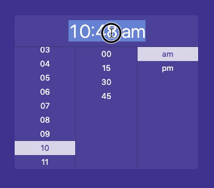

# TimePicker

An accessible and customisable React TimePicker.

This is an opinionated, simplified fork of [rc-time-picker](https://react-component.github.io/time-picker/) with the following changes:

### Styling

- very minimal styling (see [codesandbox](https://codesandbox.io/s/styled-time-picker-13h6y) for example of how we're using it in our app)
  - uses styled components instead of less
  - uses flexbox for columns instead of floating & fixed widths
- the panel now expands inline instead of popping above the content
- in collapsed state the element is now a div (instead of an input). AM/PM is separated so it can be styled independently:


### Accessibility improvements

- keyboard navigation
  - press space/enter to open or select options
  - press escape to close panel
  - change time and navigate between lists with arrow keys
- focus trap
  - focus stays within open time picker panel and doesn't get lost to background content
  - when the panel is expanded the input is focused, and focus is returned when collapsed
- uses ul/li elements with radiogroup/radio roles - so when you select hour 3 screenreader will read "3, radio, 1 of 12, Select hour, radio group".
  - This also allows for navigating between radio groups (from "Select hour" to "Select minute") in [Group mode](https://www.apple.com/voiceover/info/guide/_1133.html#vo27943).
  - `aria-checked` is used to indicate the currently selected element
- screen-reader friendly `aria-label`s with no leading zeros (so screenreader says "one" instead of "zero one"), and labels on radio groups (e.g. "Select AM or PM").
- `aria-invalid` is used to indicate incorrectly formatted time (when entering time manually)

## Demo



https://codesandbox.io/s/styled-time-picker-13h6y

## Install

```bash
npm install @bonobolabs/time-picker
```

or

```bash
yarn add @bonobolabs/time-picker
```

## Usage

```js
import TimePicker from '@bonobolabs/time-picker'
import ReactDOM from 'react-dom'
import styled from 'styled-components'

const StyledTimePicker = styled(TimePicker)`
  /* your CSS here */
`

const App = () => (
  <StyledTimePicker
    showSecond={false} // hide seconds
    use12Hours={true} // show AM/PM
    value={moment()} // show current time
    onChange={date =>
      // on change log the updated time to the console
      console.log(date.format('LTS'))
    }
  />
)

ReactDOM.render(<App />, container)
```

See [TimePicker.jsx](./src/TimePicker.jsx) and [rc-time-picker docs](https://react-component.github.io/time-picker/#api) for options.

## License

MIT
